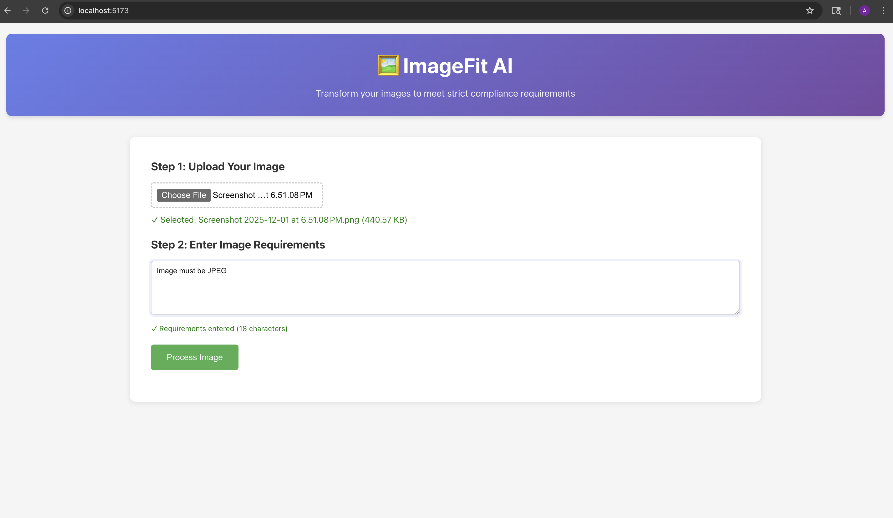
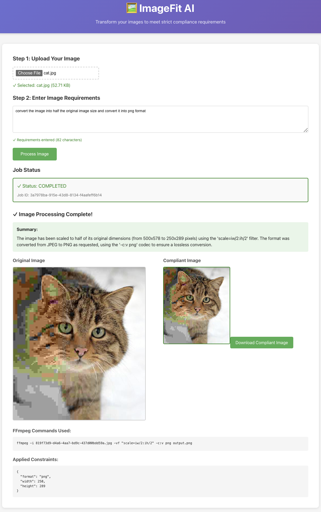

---
# YAML Frontmatter Block (Hidden when rendered on GitHub, visible in raw file)
title: "ImageFitAI Project Documentation"
project_version: "1.0.0"
license_type: "MIT"
last_updated: "2025-12-02"
# Add any other key-value pairs your team needs here
---

# ImageFitAI



**ImageFitAI** is a comprehensive web application designed to automatically resize, optimize, and manage digital images. It provides an intuitive user interface for uploads and leverages cloud storage solutions (like AWS S3) for efficient, scalable media management.

---

## 🚀 Features

*   **Automatic Optimization:** Optimizes image file size while maintaining quality during the upload process.
*   **Multiple Format Support:** Handles JPG, PNG, WEBP, and other popular image formats.
*   **Cloud Integration:** Seamlessly integrates with Amazon AWS S3 for secure and durable storage.
*   **User-Friendly UI:** A clean frontend interface for easy file uploads and link retrieval.
*   **Push Protection Compliant:** Configured to safely manage API keys using environment variables.

---

## 🛠️ Installation & Setup

### Prerequisites

Ensure you have the following installed locally:

*   [Node.js](nodejs.org) (v18+)
*   [Git](git-scm.com)
*   An active **Amazon Web Services (AWS)** account

### Local Setup Steps

1.  **Clone the repository:**
    ```bash
    git clone github.com
    cd ImageFitAI
    ```

2.  **Install dependencies:**
    ```bash
    npm install
    # or yarn install
    ```


3.  **Configure Environment Variables:**
    Create a file named `.env` in the root of your project directory. This file will store your sensitive keys safely, outside of Git tracking. Add your *newly regenerated* AWS credentials:

    ```env
    # Example .env file content
    AWS_ACCESS_KEY_ID=[Your AWS Access Key ID]
    AWS_SECRET_ACCESS_KEY=[Your AWS Secret Access Key]
    AWS_REGION=us-east-1 
    S3_BUCKET_NAME=your-imagefitai-bucket
    ```

4.  **Run the application:**
    ```bash
    npm start
    # or yarn start
    ```

5. **Current Working Tools**
    Utilizing Gemini-2.5-pro for now.

6. **Sample Result**
    

---

## 💡 Usage

Navigate to `http://localhost:3000` in your web browser. Use the provided upload form to select an image file from your computer. Upon upload, the image is processed by the backend and stored securely in your AWS S3 bucket. A confirmation message and a link to the optimized image will be provided.

---

## 🏗️ Technologies Used

*   **Frontend:** React (likely), HTML5, CSS3
*   **Backend:** Node.js, Express.js
*   **Storage:** Amazon AWS S3
*   **LLM Model:** Gemini-2.5-pro
*   **Version Control:** Git & GitHub

---

## 🤝 Contributing

Contributions are welcome! If you find a bug or have an enhancement idea, please follow these steps:

1.  Fork the repository.
2.  Create your feature branch (`git checkout -b feature/AmazingFeature`).
3.  Commit your changes (`git commit -m 'Add some AmazingFeature'`).
4.  Push to the branch (`git push origin feature/AmazingFeature`).
5.  Open a Pull Request into the `main` branch.

---

## 📄 License

This project is licensed under the **MIT License**. See the `LICENSE` file for more details.


